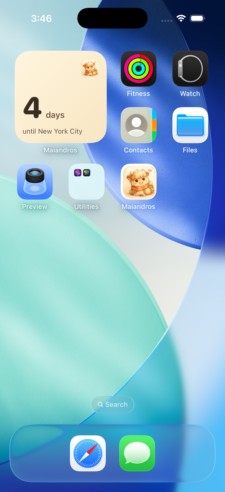
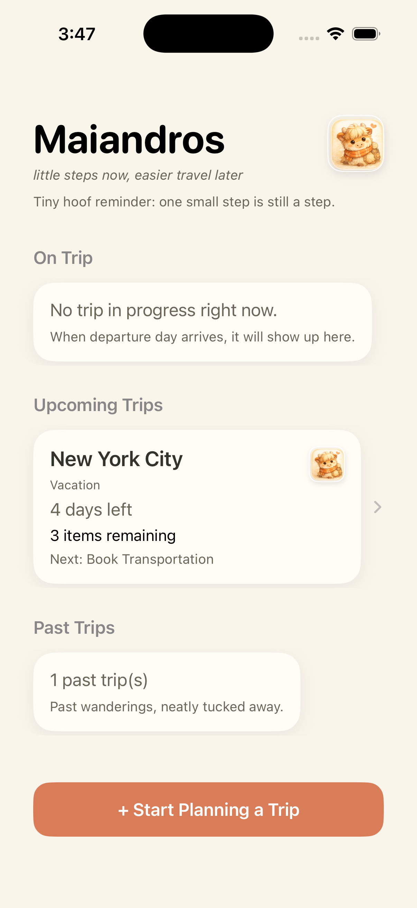
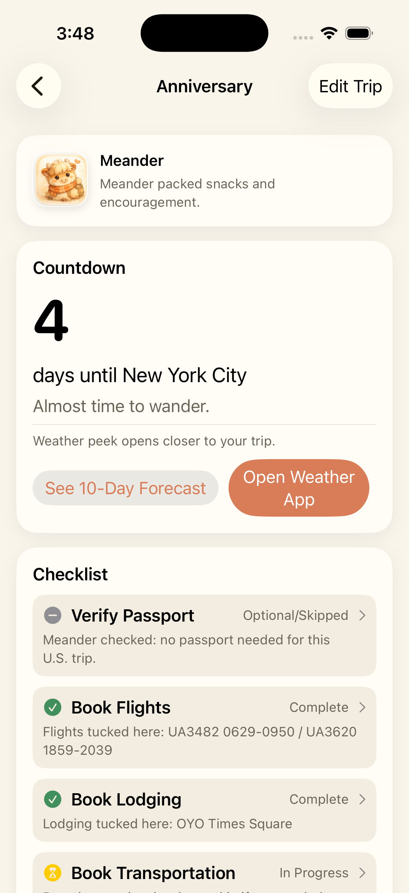
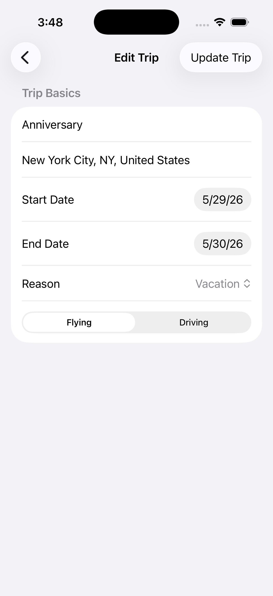
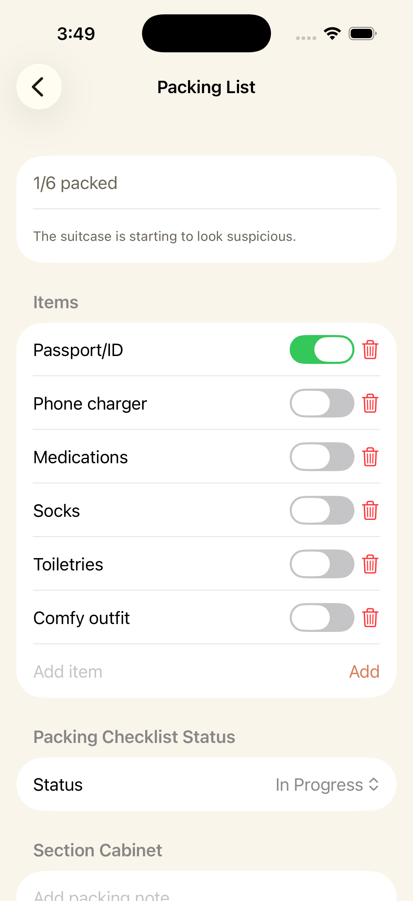
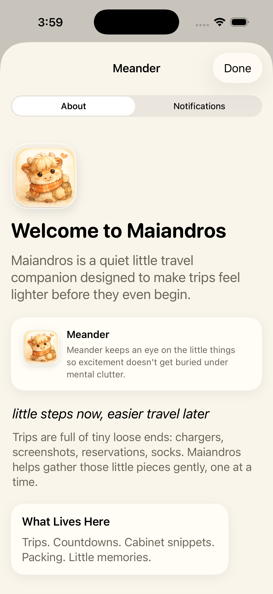
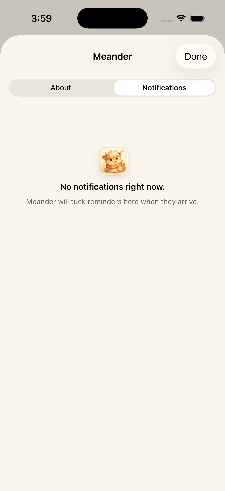

# Maiandros (iOS SwiftUI)

Maiandros is a calm, cozy trip-readiness companion app with local-only storage and no account system.

[Jump to Screenshot Gallery](#screenshots)

## What V1 Includes

- Home screen with current trips, past trips placeholder, and trip cards
- Tappable Meander badge on Home that opens a lightweight About screen
- Trip creation flow (name, destination, reason, start/end dates, flying/driving)
- Branded in-app splash screen after launch
- Reusable Meander mascot component system (`MeanderAvatar`) for consistent identity across Home/About/Detail/empty states
- Trip detail with:
  - Countdown section
  - Weather peek architecture with WeatherKit provider + mock fallback
  - Checklist with statuses (`Needs Action`, `Upcoming`, `In Progress`, `Complete`, `Optional/Skipped`) and per-item detail screens
  - Section Cabinet blocks inside checklist detail screens that also write to global Cabinet
  - Dedicated packing detail screen with auto progress-to-status sync
  - Home Preparation detail screen with editable task list and progress sync
  - Cabinet notes with flexible tags and optional photo/screenshot attachments
  - Trip Album for local photos/screenshots
- Local persistence using JSON in app Documents
- Centralized Meander quote service with context-aware rotating lines
- Highland-cow visual placeholders with asset replacement map for future illustration pass

## Project Structure

- `Maiandros/App` app entry and shell
- `Maiandros/Design` colors and shared card styling
- `Maiandros/Models` trip/checklist/packing/cabinet models
- `Maiandros/State` local store and seed logic
- `Maiandros/Services` quote + weather abstractions
- `Maiandros/Features` Home, Trip Creation, Trip Detail
- `Maiandros/Resources` asset catalog
- `Maiandros/Resources/MeanderPlaceholders` asset naming/TODO map for final mascot art

## Notes

- No backend, no login, no APIs
- WeatherKit setup may require enabling capability in Apple Developer/Xcode signing settings
- Passport validity helper computes `trip end date + 6 months` guidance
- U.S. destination inference skips passport stress for likely domestic trips (for example NYC)
- Flight checklist state starts as `Upcoming` when trip is far out

## Open In Xcode

1. Open `Maiandros.xcodeproj`
2. Set your own Team + Bundle Identifier (`com.example.Maiandros` is placeholder)
3. Run on an iPhone simulator or device

## Screenshots

1. Widget and Icon  

2. Home Screen  

3. Trip Details  

4. Edit Trip Details  

5. Packing List  

6. About Maiandros  

7. Notifications  

## Next V1.1 Ideas

- Domestic/international inference for checklist nuance
- Weather preview module
- Better Meander visual system + mascot art assets
- Cabinet attachment types (images, files)
- Widget extension
